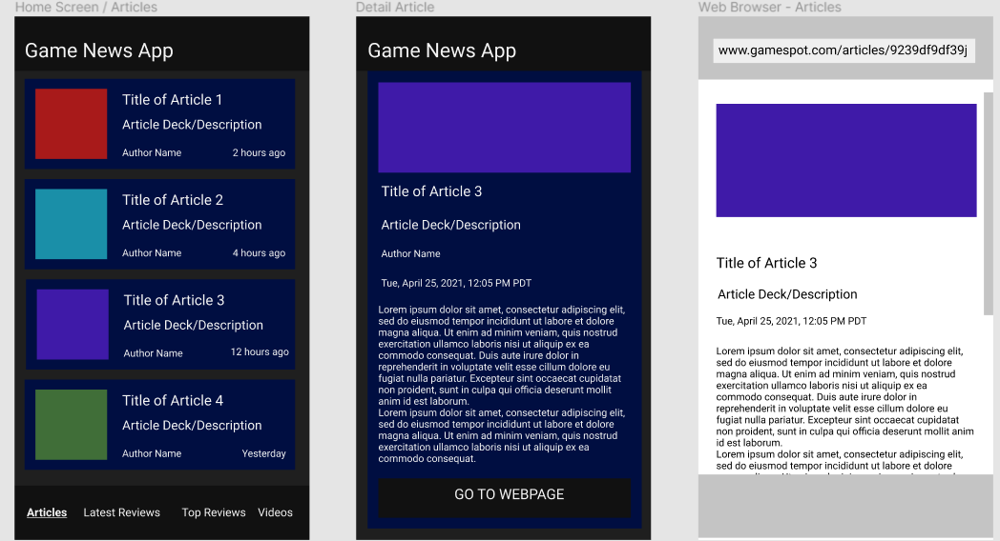
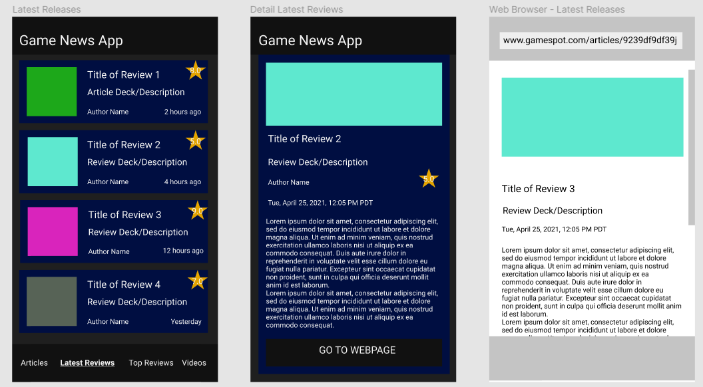
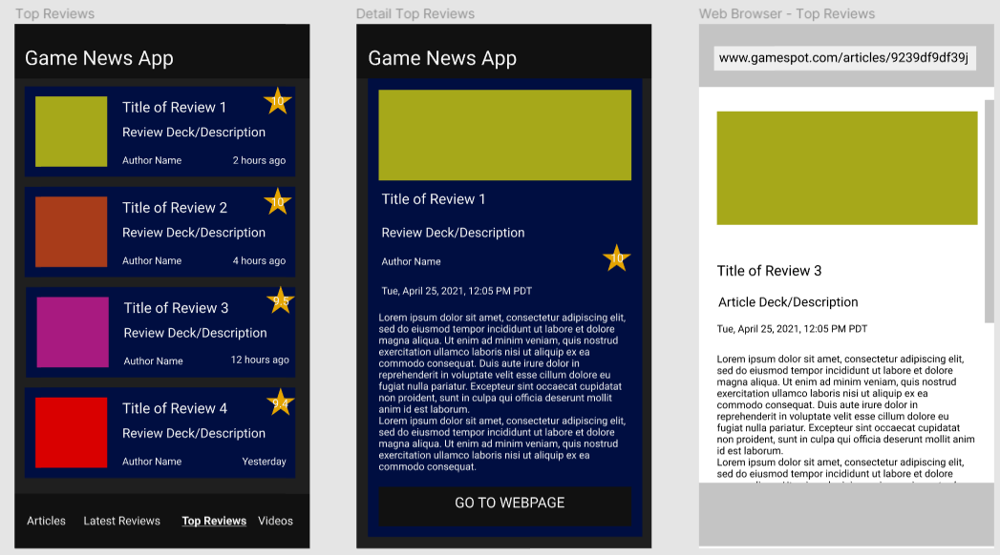
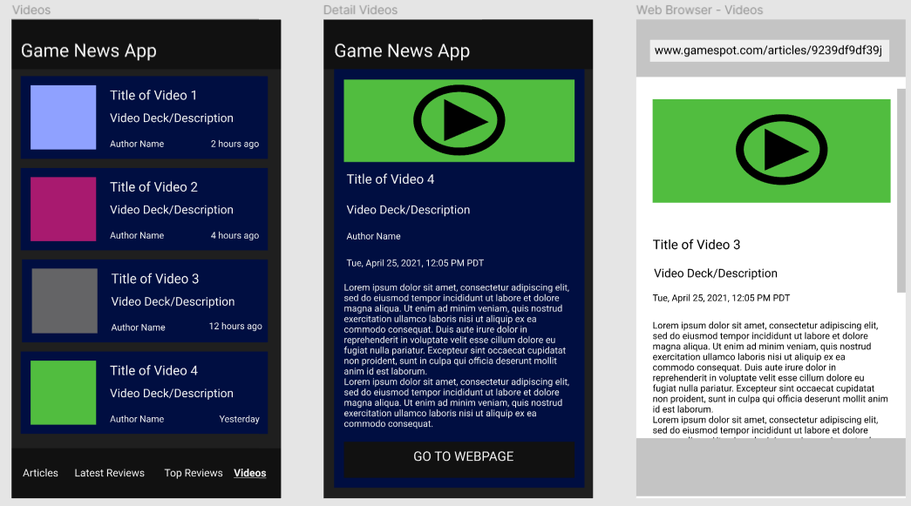
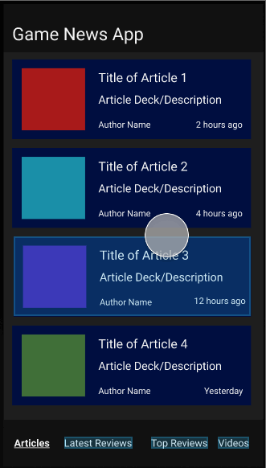

# Game News App

## Table of Contents
1. [Overview](#Overview)
1. [Product Spec](#Product-Spec)
1. [Wireframes](#Wireframes)
1. [Schema](#Schema)

## Overview
### Description
Scrolls through various video articles and movie news articles, the latest articles reviews, top articles reviews, and random videos provided by the [GameSpot API](https://www.gamespot.com/api/).

### App Evaluation
- **Category:** Video Games / Movies
- **Story:** Displays the latest articles based on video articles and movies, and the top and latest articles reviews. The user can decide what articles, reviews, or videos to view in more detail.
- **Market:** Any individual could use this app, but the majority of users will most likely be gamers.
- **Habit:** This app could be used as often or unoften as the user wanted depending on how often their interest in the latest articles articles and reviews.
- **Scope:** The app will attempt to be placed on the Google Play Store for non-commercial use, however after that the app will not receive updates due to GameSpot's API terms of use denying users of making a competing product.

## Product Spec
### 1. User Stories (Required and Optional)

**Required Must-have Stories**

- [X] User scrolls through the latest GameSpot articles and can view articles that are selected.
- [X] User has a navigation bar to transition to the latest GameSpot articles reviews, top reviews, and random videos (and can navigate back to articles).
- [X] User scrolls through the latest GameSpot reviews and can view reviews that are selected.
- [X] User scrolls through the top GameSpot reviews and can view reviews that are selected.
- [ ] User scrolls through random videos and can watch videos that are selected.

**Optional Nice-to-have Stories**

- [ ] User can drag down at the top of one of the scrolls to refresh to check for more articles/reviews/videos.
- [ ] "Infinite" pagination (limited due to GameSpot API of 100 IDs)
- [ ] Favorites tab that can store any articles/reviews/videos that the user can store on their device or a backend database.
- [ ] Search bar for each category.
- [ ] User can select different quality videos in the Videos Screen.
- [ ] Settings tab that the user can set certain settings such as light/dark mode, text font, themes, etc.

### 2. Screen Archetypes

* Articles Screen
   * Calls a GET request to obtain and display the latest 20 articles' title, description/deck, author name, and time ago since publish time.
   * Loads the article image when user scrolls it into view.
* Articles Detail Screen
   * Loads and displays the HD image, title, description/deck, author name, publish date and time based on timezone, and body.
   * User can press a button to open a web browser and goes to the GameSpot article.
* Latest Game Reviews Screen
   * Calls a GET request to obtain and display the latest 20 articles reviews' title, description/deck, author name, time ago since publish time and score.
   * Loads the article image when user scrolls it into view.
* Latest Game Reviews Detail Screen
   * Loads and displays the HD image, title, description/deck, author name, publish date and time based on timezone, body and score.
   * User can press a button to open a web browser and goes to the GameSpot review.
* Top Rated Game Reviews Screen
   * Calls a GET request to obtain and display the highest scored top 20 articles reviews' title, description/deck, author name, time ago since publish time and score.
   * Loads the article image when user scrolls it into view.
* Top Rated Game Reviews Detail Screen
   * Loads and displays the HD image, title, description/deck, author name, publish date and time based on timezone, body and score.
   * User can press a button to open a web browser and goes to the GameSpot review.
* Videos Screen
   * Calls a GET request to obtain and display the latest 20 videos' title, description/deck, and time ago since publish time.
   * Loads the article image when user scrolls it into view.
* Videos Detail Screen
   * Loads and displays the high quality video, title, description/deck, publish date and time based on timezone, and body.
   * User can press a button to open a web browser and goes to the GameSpot's source of the displayed video.

### 3. Navigation

**Tab Navigation** (Tab to Screen)

* Article Selection
* Latest Game Reviews Selection
* Top Rated Game Reviews Selection
* Videos Selection

Optional:
* Favorites
* Settings

**Flow Navigation** (Screen to Screen)
* Initial Starting Screen, Article Selection -> Article Detail View -> Open web browser to GameSpot article
* Latest Game Reviews Selection -> Latest Game Reviews Detail View -> Open web browser to GameSpot reivew
* Top Rated Game Reviews Selection -> Top Rated Game Reviews Detail View -> Open web browser to GameSpot reivew
* Videos Selection -> Videos Detail View -> Open web browser to GameSpot article/review

## Wireframes
### Digital Wireframes & Mockups
#### [View Wireframe on Figma](https://www.figma.com/file/Ngljge013iCNdjGYGnfkyh/Game-News-App?node-id=0%3A1)
<br>
<br>
<br>
<br>

### Interactive Prototype
#### [View Wireframe on Figma](https://www.figma.com/proto/Ngljge013iCNdjGYGnfkyh/Game-News-App?scaling=scale-down&page-id=0%3A1&node-id=1%3A2)


## Schema 
### Models
#### Post

   | Property      | Type     | Description |
   | ------------- | -------- | ------------|
   | objectId      | String   | unique id for the user post (default field) |
   | author        | Pointer to User| image author |
   | image         | File     | image that user posts |
   | caption       | String   | image caption by author |
   | commentsCount | Number   | number of comments that has been posted to an image |
   | likesCount    | Number   | number of likes for the post |
   | createdAt     | DateTime | date when post is created (default field) |
   | updatedAt     | DateTime | date when post is last updated (default field) |
### Networking
#### List of network requests by screen
   - Home Feed Screen
      - (Read/GET) Query all posts where user is author
         ```swift
         let query = PFQuery(className:"Post")
         query.whereKey("author", equalTo: currentUser)
         query.order(byDescending: "createdAt")
         query.findObjectsInBackground { (posts: [PFObject]?, error: Error?) in
            if let error = error { 
               print(error.localizedDescription)
            } else if let posts = posts {
               print("Successfully retrieved \(posts.count) posts.")
           // TODO: Do something with posts...
            }
         }
         ```
      - (Create/POST) Create a new like on a post
      - (Delete) Delete existing like
      - (Create/POST) Create a new comment on a post
      - (Delete) Delete existing comment
   - Create Post Screen
      - (Create/POST) Create a new post object
   - Profile Screen
      - (Read/GET) Query logged in user object
      - (Update/PUT) Update user profile image
#### [OPTIONAL:] Existing API Endpoints
##### An API Of Ice And Fire
- Base URL - [http://www.anapioficeandfire.com/api](http://www.anapioficeandfire.com/api)

   HTTP Verb | Endpoint | Description
   ----------|----------|------------
    `GET`    | /characters | get all characters
    `GET`    | /characters/?name=name | return specific character by name
    `GET`    | /houses   | get all houses
    `GET`    | /houses/?name=name | return specific house by name

##### Game of Thrones API
- Base URL - [https://api.got.show/api](https://api.got.show/api)

   HTTP Verb | Endpoint | Description
   ----------|----------|------------
    `GET`    | /cities | gets all cities
    `GET`    | /cities/byId/:id | gets specific city by :id
    `GET`    | /continents | gets all continents
    `GET`    | /continents/byId/:id | gets specific continent by :id
    `GET`    | /regions | gets all regions
    `GET`    | /regions/byId/:id | gets specific region by :id
    `GET`    | /characters/paths/:name | gets a character's path with a given name